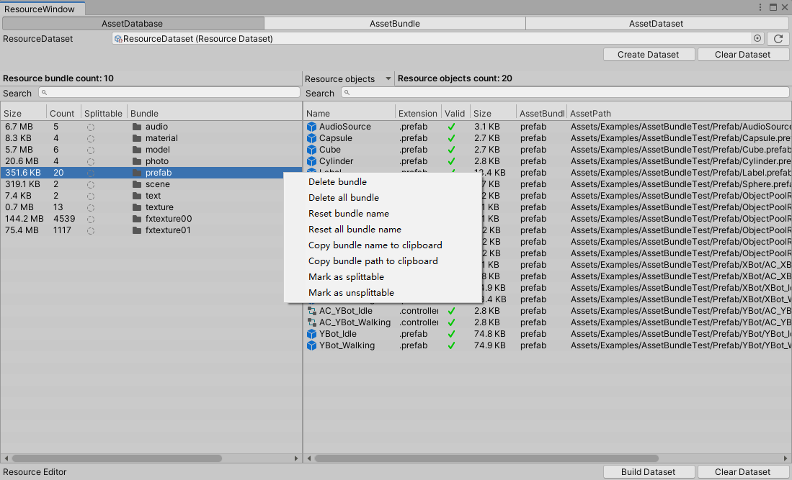
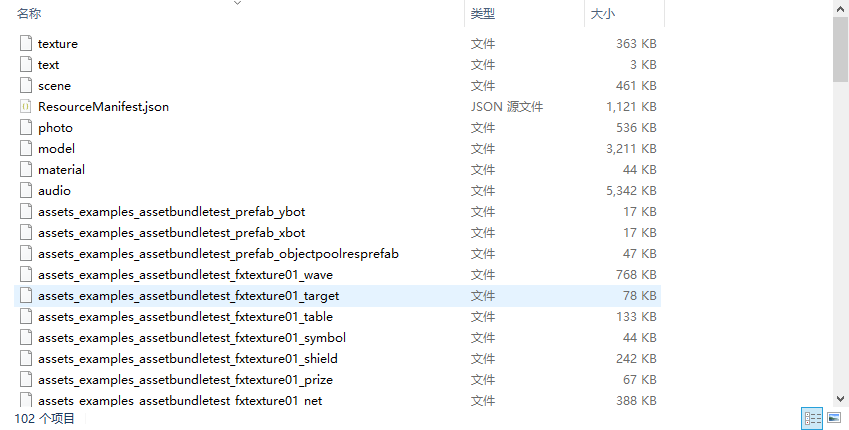

# [English](RESOURCE_EDITOR_EN.md) 


<a name="ResourceModule"></a>

# ResourceModule
- [ResourceRuntime](#ResourceRuntime)
  - [LoadRuntimeAsset](#Load-Runtime-Asset)
  - [UnloadRuntimeAsset](#Unload-Runtime-Asset)
  - [UnloadRuntimeAssetBundle](#Unload-Runtime-AssetBundle)
- [ResourceEditor](#ResourceEditor)
  - [AssetDatabaseTab](#AssetDatabaseTab)
    - [AssetBundleTabMenu](#AssetBundleTab-Menu)
  - [AssetBundleTab](#AssetBundleTab)
    - [BuildBundleNameType](#Build-Bundle-Name-Type)
  - [AssetDatasetTab](#AssetDatasetTab)

<a name="ResourceRuntime"></a>

## ResourceRuntime

* ResourceModule 内置提供AssetDatabase、AssetBundle以及Resource三种加载模式。
    * Resource为Unity Resources的wrapper，封装了异步加载回调等常用的功能。
    * AssetDatabase仅为unity editor模式下使用。此模式可在开发阶段无需构建assetbundle，从而减少开发周期。加载资源时需要依赖ResourceDataset寻址。
    * AssetBundle模式需要构建assetbundle后使用。构建assetbundle时依赖ResourceDataset作为构建的预设。
  
* AssetDatabase与AssetBundle模式支持引用计数，资源包会根据引用计数自动管理包体的加载或卸载。
  
* ResourceDataset是resource模块的配置文件，AssetDatabase加载资源与AssetBundle构建ab都依赖此配置。此文件可在ResourceEditor中生成。

* AssetDatabase与AssetBundle模式支持以下寻址方式：
  * 资源名。(e.g. MyConfig)
  * 资源名.后缀名。(e.g. MyConfig.json)
  * Assets下的完整路径。(e.g. Assets/Config/MyConfig.json)

<a name="Load-Runtime-Asset"></a>

  ### Load Runtime Asset

  * Resource加载均为异步加载，异步方式包含Coroutine&callback加载与async/await加载。

  * 资源加载遵循ResourceRuntime的三种寻址方式

```csharp
    async void LoadAsync()
    {
        //async/await加载
        var go = await CosmosEntry.ResourceManager.LoadPrefabAsync("Prefabs/ResCube", true);
    }
        //Coroutine&callback加载
    void LoadCubeAsync()
    {
        CosmosEntry.ResourceManager.LoadPrefabAsync("Prefabs/ResCube", (go) =>
         {
             go.transform.position = new Vector3(3, 0, 0);
         }, null, true);
    }

```
<a name="Unload-Runtime-Asset"></a>

  ### Unload Runtime Asset

  * 资源卸载遵循ResourceRuntime的三种寻址方式

 ```csharp
    void UnloadAsset()
    {
        //资源名卸载
        CosmosEntry.ResourceManager.UnloadAsset("MyText");
        //资源名.后缀名卸载
        CosmosEntry.ResourceManager.UnloadAsset("MyText.json");
        //Assets下的完整路径卸载
        CosmosEntry.ResourceManager.UnloadAsset("Assets/Configs/MyText.json");
    }
```

<a name="Unload-Runtime-AssetBundle"></a>

  ### Unload Runtime AssetBundle

 ```csharp
    void UnloadAssetBundle()
    {
        //卸载assetbundle
        CosmosEntry.UnloadAssetBundle.UnloadAsset("MyBundle",true);
    }
```

-----

<a name="ResourceEditor"></a>

## ResourceEditor

<a name="AssetDatabaseTab"></a>

### AssetDatabaseTab


* 如图为ResourceEditor的AssetDatabase页面。
  
* 此页面中，左侧的每一个bundle都对应一个文件夹，右侧的object为这个bundle，即这个文件夹中包含的可加载资源。每个bundle都只能以文件夹形式存在，若单独一个资源需要作为一个bundle，则需要创建一个文件夹，然后将此资源放入到这个文件夹中，方可作为bundle存在。
  
* 配置ResourceDataset：
    * 1.点击顶部的`Create Dataset`按钮，生成一个ResourceDataset。
    * 2.将需要被构建成assetbundle的文件夹拖拽入左侧的bundle框中。
    * 3.点击底部的`Build Dataset`按钮，完成构建。

* 案例中包含有一个ResourceDataset，可查看此文件。

-----

<a name="AssetBundleTab-Menu"></a>

#### AssetBundleTab Menu

* 右键点击bundle，显示功能菜单。



* 右键点击object，显示功能菜单。


<a name="AssetBundleTab"></a>

### AssetBundleTab

* 如图为ResourceEditor的AssetBundleTab页面。
  
* 构建assetbundle：
    * 1.点击`BuildTarget`选择对应的平台。
    * 2.其余默认或者按照需要配置。
    * 3.点击`Build assetbundle`按钮构建。
  
* 构建完成的assetbundle输出地址可在此页面的`Bundle build path`中查看。

<a name="Build-Bundle-Name-Type"></a>

#### Build Bundle Name Type

* AssetBundleTab构建时可通过`Build bundle name type`选择assetbundle构建后的资源名称。
  
* 使用`Hash Instead`，构建出来的ab以hash命名。
  


* 使用`Default Name`构建出来的ab与AssetDatabaseTab面板中看到的命名相同。



-----

<a name="AssetDatasetTab"></a>

### AssetDatasetTab


* 此页面为ResourceDataset可识别的文件后缀名列表。
  
* 若自定义的文件因为后缀名无法被识别，则在此页面添加对应的后缀名，重新在AssetBundleTab或AssetDatabaseTab中构建。

**[Back to top](#ResourceModule)**