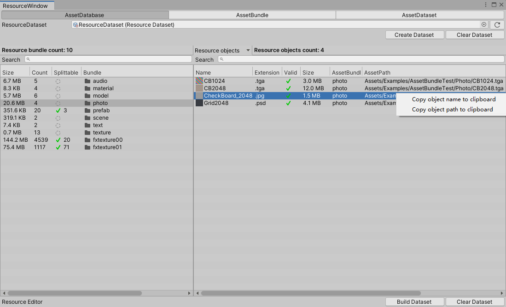
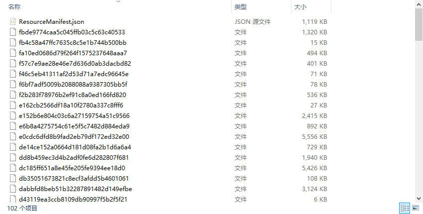

# [中文](RESOURCE_EDITOR.md) 

# ResourceModule

## ResourceRuntime

* ResourceModule has three built-in loading modes: AssetDatabase, AssetBundle and Resource.
    * Resource is a wrapper for Unity Resources, encapsulating common functions such as asynchronous loading callbacks.
    * AssetDatabase is only available in unity editor mode. This mode reduces the development cycle by eliminating the need to build assetbundle during the development phase. It relies on ResourceDataset addressing when loading resources.
    * AssetBundle pattern needs to be used after building assetbundle. When building the assetbundle, it relies on the ResourceDataset as a preset for the build.
  
* AssetDatabase and AssetBundle modes support reference counting, and resource packages automatically manage the loading or unloading of package bodies based on the reference count.
  
* ResourceDataset is the configuration file of resource module, which is relied on by AssetDatabase to load resources and AssetBundle to build ab. This file can be generated in ResourceEditor.

* The AssetDatabase and AssetBundle modes support the following addressing methods.
  * ResourceName.(e.g. MyConfig)
  * ResourceName.Extension((e.g. MyConfig.json))
  * AssetsPath.((e.g. Assets/Config/MyConfig.json))
-----

## ResourceEditor

### AssetDatabaseTab

* The figure shows the AssetDatabase page of ResourceEditor.
  
* In this page, each bundle on the left side corresponds to a folder, and the object on the right side is the bundle, that is, the loadable resources contained in this folder. Each bundle can only exist as a folder, if a resource needs to be a bundle, you need to create a folder and put this resource into this folder before it can exist as a bundle.
  
* Configure ResourceDataset:
    * 1.Click the `Create Dataset` button at the top to generate a ResourceDataset.
    * 2.Drag and drop the folder that needs to be built as an assetbundle into the bundle box on the left.
    * 3.Click the `Build Dataset` button at the bottom to complete the build.

* A ResourceDataset is included in the case and this file can be viewed.

-----

#### AssetBundleTab Menu

* Right-click the bundle to display the function menu.

* Right-click the OBJECT to display the function menu.

### AssetBundleTab

* The figure shows the AssetBundleTab page of ResourceEditor.
  
* Build assetbundle:
    * 1.Click `BuildTarget` to select the corresponding platform.
    * 2.The rest is configured by default or as needed.
    * 3.Click the `Build assetbundle` button to build.
  
* The output address of the completed assetbundle can be viewed in the `Bundle build path` on this page.

#### Build bundle name type

* AssetBundleTab builds with `Build bundle name type` to select the name of the resource after the assetbundle is built.
  
* Using `Hash Instead`, the constructed ab is named after the hash.
  

* The ab constructed using `Default Name` is named the same as the one seen in the AssetDatabaseTab panel.

-----

### AssetDatasetTab

* This page is a list of file extensions recognized by ResourceDataset.
  
* If the custom file is not recognized because of the suffix name, add the corresponding suffix name on this page and rebuild it in AssetBundleTab or AssetDatabaseTab.
